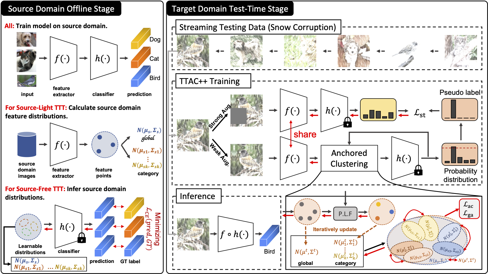

# TTAC++

This repository is an official implementation for our TPAMI paper [\[Arxiv\]](https://arxiv.org/abs/2303.10856) [\[IEEE Xplore\]](https://ieeexplore.ieee.org/abstract/document/10452869).

This repo is built upon our previous work [TTAC](https://github.com/Gorilla-Lab-SCUT/TTAC) accepted by NeurIPS 2022.

## Revisiting Realistic Test-Time Training: Sequential Inference and Adaptation by Anchored Clustering Regularizad Self-Training

**Yongyi Su<sup>1</sup>** &nbsp; **Xun Xu<sup>2</sup>** &nbsp; **Tianrui Li<sup>3</sup>** &nbsp; **Kui Jia<sup>1</sup>**
<br>
<sup>1</sup>South China University of Technology &nbsp; <br>
<sup>2</sup>Institute for Infocomm Research, A*STAR &nbsp; <br>
<sup>3</sup>Southwest Jiaotong University
<br>


### Overview




### CIFAR10/100

The code is released in the [cifar](cifar) folder.

### ImageNet-C

The code is released in the [imagenet](imagenet) folder.

### Citation

If you find our work useful in your research, please consider citing:

```bibtex
@ARTICLE{su2023revisiting,
  author={Su, Yongyi and Xu, Xun and Li, Tianrui and Jia, Kui},
  journal={IEEE Transactions on Pattern Analysis and Machine Intelligence}, 
  title={Revisiting Realistic Test-Time Training: Sequential Inference and Adaptation by Anchored Clustering Regularized Self-Training}, 
  year={2024},
  volume={},
  number={},
  pages={1-16},
  doi={10.1109/TPAMI.2024.3370963}
}
```
